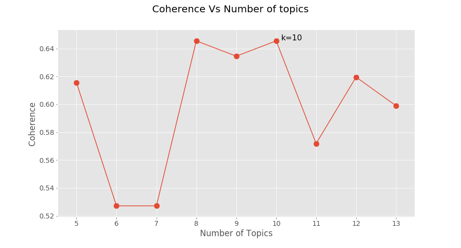

# Topic Modelling on Enron Email Dataset  
  
## Objective  
  
<i>Enron Scandal, publicized in October 2001, led to one of the largest corporate bankruptcy in the United States, and is cited as the biggest audit failure in American history. </i>  
  
This project aims to build and provide unsupervised data models which would help analyze and detect anomalies and interesting patterns in the data.  
  
### Steps Performed : 

 For this project, we are performing a social-network analysis of the email data by carrying out topic analysis using various machine learning techniques.
  

 Our end goal is to produce deliverable to separate important or relevant emails from junk emails, identify senders, receivers, and 
 
Establish a network before performing an in-depth analysis and topic modeling, which could <b>primarily aid fraud detection</b>.
  
  
## Running the Project  
  
Download the data set [here]([http://www.cs.cmu.edu/~enron/](http://www.cs.cmu.edu/~enron/))  
  
1. Project is implemented using `Python3` and `Jupyter Notebook`  
2. Libraries used `pandas, numpy, scipy, keras, scikit-learn, email, nltk, seaborn, matplotlib, spacy and wordcloud`  
  
### Data Preprocessing  
  
The available dataset is split into `150 folders` by `username`, and each folder had text files containing the email data.   
1. `Preprocess1.ipynb` - A `.csv` was made from the given data, which had two columns, `filename` and its corresponding `content`.    
2. `Preprocess2.ipynb` -   
   - Reads the `.csv` file and creates a list of map of messages using the email module.   
   - Extracts the message headers from the content to make a data frame which includes the headers as columns, and the corresponding data as its values.    
   - Remove lesser useful columns from the data frame like `content(which had original unprocessed content), mime-version, content-type, and content-transfer-encoding.`  
  - Using English NLP package to remove unnecessary words which don’t contribute to the sentiment of the message (also called stop words) and performing lemmatization, which is used to break a word to its root word.   
  
### Exploratory Data Analysis `EDA.ipynb`   
Uses the data processed to perform an initial analysis by performing various tasks like `Top 10 users, Top 10 email users, Top 10 senders, Top 10 receivers, Top 10 conversing pair, Email count by year, Word clouds for email subject and body and Top 10 users' communication outside of Enron`.  
  
#### Results - It is observed that some people sent a lot of mails to themselves as a way to backup them up.   
- There are also emails that were dated to some future and past dates (after/before company ceased operations).  
  
Top 10 Users | Top 10 Receivers Outside Enron  
------------ | -------------  
 |   

Top 10 Senders | Top 10 Receivers  
------------ | -------------
 |   
   
Word Cloud of Subject and Content give us an Idea of the the data.  
  
Subject | Content  
------------ | -------------  
 |   
  
### Clustering  `Clustering.ipynb`   
Segregating relevant and irrelevant emails is an important step to refine the emails which will aid in fraud detection.   
* Mini batch K-Means Clustering is used to cluster emails based on the top terms. Vectorized data is used for this purpose.   
* A more robust model for further dimensionality reduction is needed in a semantic sense of the text data, hence, Topic Modeling.   
* Clustering serves as a baseline method.  
  
  
  
### Topic Modelling   

#### Latent Semantic Analysis `LSA.ipynb` 

<i>LSA is a distributional semantics method of analyzing relationships among documents and the terms they contain by producing a set of topics linking the documents and terms.</i>  
* Gensim LsiModel - Fast TruncatedSVD is used  
  
  
  
#### Latent Dirichlet Allocation `LDA.ipynb` 

<i>LDA is a generative probabilistic model for collections of discrete datasets such as email text data. This method is used for discovering abstract topics from a collection of over 5 million emails.</i>  
* LatentDirichletAllocation module from Gensim decomposition package.  
* Since it’s a probabilistic model, it uses raw term counts. Thus, we first create a term-document matrix and use it for feature extraction.  
  
  
  
#### Non-Negative Matrix Factorization `NMF.ipynb`   
   
<i>NMF is a linear algebra based technique that factorizes high dimension vectors into a lowdimensionality representation. It has a unique property, which states that the lower dimension representations have no negative elements</i>  
   
 * NMF method from the Gensim module gets the clusters from the document and the membership weights for each cluster in every document.  
 * Hyperparameter tuning is based on the number of topics(K).   
 * Coherence score is the evaluation metric.   
 * K with highest coherence score is selected. ( <b>K = 9</b> )  
  
Params1 | Params2  
------------ | -------------  
w = 0.0001 | w = 0.001  
h = 0.001 | h = 0.01  
 |   
  
Top 20 Terms for 9 Topics  
    
  
  
## Conclusion  
  ### Comparison of Coherence Scores   
The following graph shows the comparison of Coherence scores for all the three models  
after performing Hyperparameter tuning  
  
  
  
We can see that the coherence score for NMF is the highest.   
Higher the coherence score, better the model, we decided to proceed further with NMF for our investigation.  
  
### Plotting Email distribution per topic for the year 2000 and 2001  
  
2000 | 2001  
------------ | -------------  
 |   
  
  
* The number of emails belonging to each of the topics spike in months of September - December in 2000 and continued from January - June in 2001.  
* There was a major drop in the months of July - September 2001, which is suspicious.  
* Sudden spike in conversations after Sept 2001.  
* We were also able to segregate emails according to the topics, which aid in potential fraud investigation.  
* In topic 8, there were a lot of references to the words ’California’, ’Power, ’Utility’ and ’Energy’, which could be traced back to how the company was held responsible for allegedly creating artificial energy shortages in the state of California.  
* Furthermore, Topic 1 contains keywords like ’stocks’ ,’shares’, ’financial’, ’trading’, etc. Analysis of emails related to this topic could lead to a trail of any financial irregularities when combined with the financial data related to enron.  
* While we did not consider financial data in our analysis, the results obtained can be combined with any financial data analysis to further determine persons of interest.
